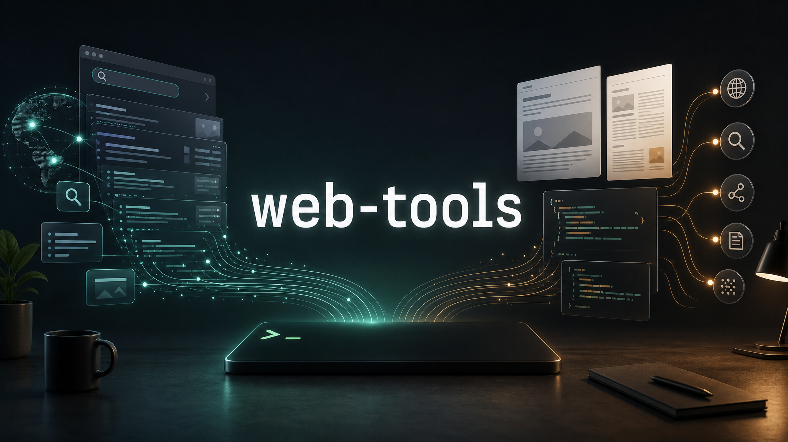
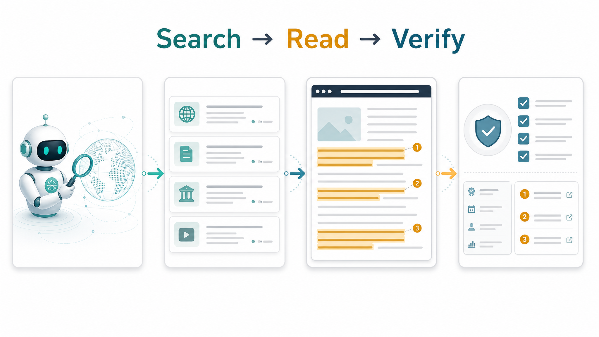
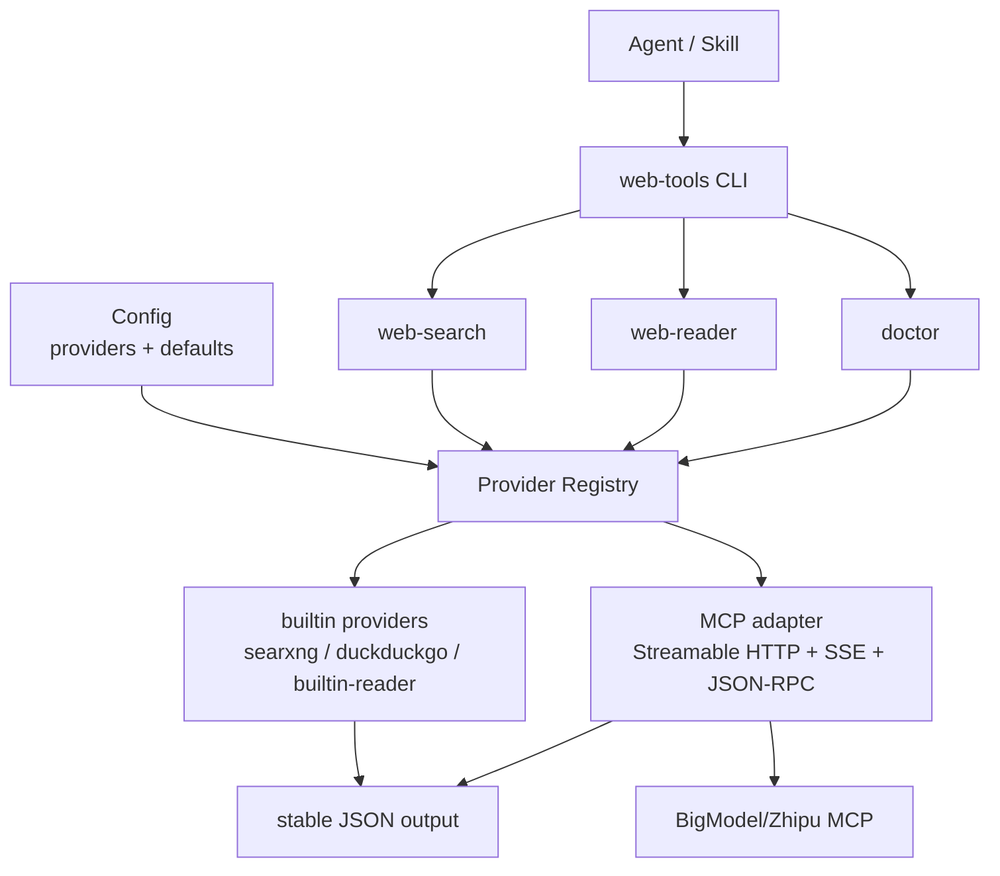

# web-tools

[中文文档](README.zh-CN.md)



Local-first web search and reading CLI for AI agents.

Zero cost by default. No API keys required for the local-first path.

[Releases](https://github.com/koda-claw/web-tools/releases)

## What it does

- **web-search**: Search the web via DuckDuckGo Lite by default, optional local SearXNG, or configured MCP providers
- **web-reader**: Extract readable content from URLs or convert local files (PDF, DOCX, PPTX, XLSX) to Markdown, with optional MCP providers

## Agent Quick Start

If another agent only has this repository URL, have it follow this order:

1. Install the `web-tools` CLI binary or build it from source.
2. Run `web-tools setup` to install the Agent skill and inspect local readiness.
3. Run `web-tools doctor --json` and fix only hard errors. Missing optional dependencies are warnings.
4. Use `web-tools web-search "<query>" --json` to find candidate sources.
5. Use `web-tools web-reader "<url>" --json` to read selected pages.
6. Inspect `quality` metadata and retry with `--browser` only for sparse or JS-rendered pages.

The CLI provides explicit search, read, quality, and error signals. The skill
guides the agent on source selection, browser fallback, partial failures, and
preserving source URLs.

If the CLI is already installed but may be stale, agents should first run:

```bash
web-tools upgrade --check --json
web-tools upgrade
```



## Install

### Download binary

Download from [GitHub Releases](https://github.com/koda-claw/web-tools/releases):

```bash
# macOS ARM64
curl -sL https://github.com/koda-claw/web-tools/releases/latest/download/web-tools-darwin-arm64 -o /usr/local/bin/web-tools && chmod +x /usr/local/bin/web-tools

# macOS x64
curl -sL https://github.com/koda-claw/web-tools/releases/latest/download/web-tools-darwin-amd64 -o /usr/local/bin/web-tools && chmod +x /usr/local/bin/web-tools

# Linux x64
curl -sL https://github.com/koda-claw/web-tools/releases/latest/download/web-tools-linux-amd64 -o /usr/local/bin/web-tools && chmod +x /usr/local/bin/web-tools

# Windows x64
curl -sL https://github.com/koda-claw/web-tools/releases/latest/download/web-tools-windows-amd64.exe -o /usr/local/bin/web-tools.exe

# Windows ARM64
curl -sL https://github.com/koda-claw/web-tools/releases/latest/download/web-tools-windows-arm64.exe -o /usr/local/bin/web-tools.exe
```

### Install from source checkout

Requires Go 1.23+.

```bash
git clone https://github.com/koda-claw/web-tools.git
cd web-tools

# Install CLI only.
sh scripts/install.sh

# Or install CLI plus the Agent skill.
SKILL_DIR="$HOME/.codex/skills" sh scripts/install.sh
```

Make sure the install directory is on `PATH`, then verify:

```bash
web-tools --version
web-tools doctor --json
```

If you installed only the CLI binary, initialize the Agent skill from the CLI:

```bash
web-tools setup
```

## Upgrade

Use the built-in upgrade command to update the CLI and Agent skill together:

```bash
web-tools upgrade
web-tools upgrade --check --json
```

`upgrade` resolves the target release, downloads the matching single-file binary
for the current platform, verifies `checksums.txt`, replaces the configured CLI
path, and installs the matching `web-tools` skill. It does not modify
`config.json`, env files, or cache directories.

Useful variants:

```bash
web-tools upgrade --version v1.6.0
web-tools upgrade --bin-dir "$HOME/.local/bin"
web-tools upgrade --only-skill
```

## Quick start

### 1. Search works out of the box

`web-search` uses DuckDuckGo Lite by default and does not require Docker or API keys.

SearXNG is optional for higher throughput and more sources:

```bash
cd docker && docker compose up -d
```

Verify: `curl -s http://localhost:8888/search?q=test&format=json | head -c 200`

### 2. Install optional reader dependencies

```bash
# For file conversion (PDF, DOCX, PPTX, XLSX)
pip install markitdown

# For browser fallback (JS-rendered pages)
npm i -g agent-browser
```

### 3. Use

```bash
# Search
web-tools web-search "latest AI news"
web-tools web-search "AI latest developments" --locale en-US --limit 3
web-tools web-search "golang readability" --include-domain github.com --exclude-domain reddit.com
web-tools web-search "golang readability" --provider duckduckgo --json

# Read a URL
web-tools web-reader https://example.com/article
web-tools web-reader https://example.com/article --provider builtin-reader

# Convert a file
web-tools web-reader ./report.pdf

# Text-only or extracted HTML output
web-tools web-reader https://example.com/article --format text
web-tools web-reader https://example.com/article --format html

# Check local setup
web-tools doctor
web-tools doctor --json

# Install/update the Agent skill from the CLI
web-tools setup

# Inspect setup readiness without changing files
web-tools setup --check
web-tools setup --check --json

# Start the local GUI console for human setup
web-tools gui --no-open
```

## Test

```bash
make check
```

Equivalent direct commands:

```bash
go test ./...
go vet ./...
./scripts/smoke.sh
```

`make test` includes offline CLI integration tests. They build a temporary
`web-tools` binary, run it against local HTTP fixtures, and verify the
search-then-read Agent workflow without calling live search engines or a real
browser.

Useful local targets:

```bash
make gui
make setup-check
make install-local
```

## Doctor

Use `web-tools doctor` to check local configuration and optional dependencies. Missing optional tools such as SearXNG, MarkItDown, or agent-browser are reported as warnings; invalid config or an unwritable cache directory is reported as an error.

## Local GUI

`web-tools gui` starts a local-only management console for human setup and diagnostics:

```bash
web-tools gui
web-tools gui --no-open --port 0
```

The GUI binds to `127.0.0.1` by default. It can inspect setup readiness, configure the BigModel provider, write `~/.config/web-tools/.env`, run basic search/reader smoke tests, export non-sensitive diagnostics, and generate Agent handoff commands. It never displays or returns secret values; `config.json` stores only environment variable names such as `ZHIPU_APIKEY`.

The GUI follows the browser language by default: Chinese browsers get Chinese UI, all other languages default to English. A language selector is available in the header.

For agents and scripts, prefer the non-interactive CLI:

```bash
web-tools setup --check --json
web-tools setup --provider bigmodel --auth-env ZHIPU_APIKEY --set-env ZHIPU_APIKEY=...
web-tools upgrade --check --json
web-tools skill install --force
```

## Configuration

Config file (optional): `~/.config/web-tools/config.json` or `./web-tools.json`

```json
{
  "reader": {
    "cache_dir": "~/.cache/web-tools",
    "cache_ttl": 300,
    "default_timeout": 15,
    "browser_fallback": true,
    "markitdown_path": "markitdown",
    "agent_browser_path": "agent-browser",
    "default_provider": "auto",
    "default_provider_chain": ["builtin-reader"]
  },
  "search": {
    "searxng_url": "http://localhost:8888",
    "default_limit": 5,
    "default_locale": "auto",
    "default_engine": "auto",
    "default_provider": "auto",
    "default_provider_chain": ["searxng", "duckduckgo"]
  }
}
```

CLI flags override config defaults when provided. `--format=html` is only available when extraction produced HTML; plain text and converted local files return a structured input error instead of generated wrapper HTML.

`web-reader --json` includes a `quality` object with extraction score, word count, minimum word threshold, fallback recommendation, and reasons. Sparse extraction warnings are written to stderr so stdout remains machine-consumable.

### Provider configuration

`--provider` is the preferred selector for new integrations. `--engine` remains supported for compatibility with `auto`, `duckduckgo`, and `searxng`.

The default no-key path stays local-first:

```text
search auto: searxng -> duckduckgo
reader auto: builtin-reader
```

Optional MCP providers can be enabled through config. For BigModel/Zhipu:

```bash
web-tools setup --provider bigmodel --auth-env ZHIPU_APIKEY
web-tools setup --provider bigmodel --auth-env ZHIPU_APIKEY --set-env ZHIPU_APIKEY=...
web-tools doctor --json
web-tools web-search "Go readability library" --provider bigmodel --json
web-tools web-reader "https://github.com/go-shiori/go-readability" --provider bigmodel --json
```

`--set-env` writes the token to `~/.config/web-tools/.env` with `0600`
permissions. The CLI loads this user env file automatically; existing shell
environment variables still take precedence. For one-off use, exporting
`ZHIPU_APIKEY` in the current shell also works.

To include BigModel in `--provider auto` search fallback:

```bash
web-tools setup \
  --provider bigmodel \
  --auth-env ZHIPU_APIKEY \
  --enable-search-auto
```

`web-tools setup` installs or updates the Agent skill, writes provider config
when requested, optionally writes an env file, and runs `doctor`. The config
command is also available for focused changes:

```bash
web-tools config provider add bigmodel --preset bigmodel --auth-env ZHIPU_APIKEY
```

These commands write `~/.config/web-tools/config.json` by default and store only
the environment variable name, not the token value. Tokens belong in the current
shell environment or `~/.config/web-tools/.env`; they are never written to
`config.json`. Equivalent JSON:

```json
{
  "providers": {
    "bigmodel": {
      "type": "mcp",
      "auth_env": "ZHIPU_APIKEY",
      "enabled_if_env": "ZHIPU_APIKEY",
      "timeout": 30,
      "capabilities": ["search", "reader"],
      "search": {
        "url": "https://open.bigmodel.cn/api/mcp/web_search_prime/mcp",
        "tool": "web_search_prime"
      },
      "reader": {
        "url": "https://open.bigmodel.cn/api/mcp/web_reader/mcp",
        "tool": "webReader"
      }
    }
  },
  "search": {
    "default_provider_chain": ["searxng", "bigmodel", "duckduckgo"]
  }
}
```

Secrets are read only from environment variables. `doctor --json` reports whether auth is configured, but never prints the token value.


## Install as Agent Skill

Compatible with [vercel-labs/skills](https://github.com/vercel-labs/skills) CLI:

```bash
npx skills add koda-claw/web-tools
```

This installs the SKILL.md to your agent's skills directory, enabling AI agents to use web-tools automatically.

Manual skill installation is also supported. Copy the repository skill folder:

```bash
# From an installed CLI binary
web-tools skill install --dir "$HOME/.codex/skills"

# Codex-style local skill directory
mkdir -p "$HOME/.codex/skills"
cp -R skills/web-tools "$HOME/.codex/skills/"

# Generic agent skill directory
mkdir -p "$HOME/.agents/skills"
cp -R skills/web-tools "$HOME/.agents/skills/"
```

After installing the skill, ask the agent to use `web-tools` for web search,
webpage reading, article extraction, or file-to-Markdown conversion. The skill
contains the Agent research workflow.

## Provider Development

To add a new search or reader backend, start with
[`docs/provider-plugin-development-guide.md`](docs/provider-plugin-development-guide.md).
The provider model is configuration-first: use `providers.<id>` with an existing
adapter when possible, and add adapter code only when the protocol or response
mapping cannot be reused.

## Architecture



```
web-tools
├── cmd/web-reader/     # web-reader CLI entry point
├── cmd/web-search/     # web-search CLI entry point
├── internal/
│   ├── config/         # Configuration loading (file + env + defaults)
│   ├── errors/         # Structured error handling for agent consumption
│   ├── provider/       # Provider registry and MCP adapters
│   ├── reader/         # HTTP fetch, readability extraction, cache, converter, browser fallback
│   └── search/         # SearXNG client, result parsing, output formatting
├── docker/             # SearXNG docker-compose.yml + settings
└── skills/             # Agent skill documentation (SKILL.md)
```

## License

MIT
