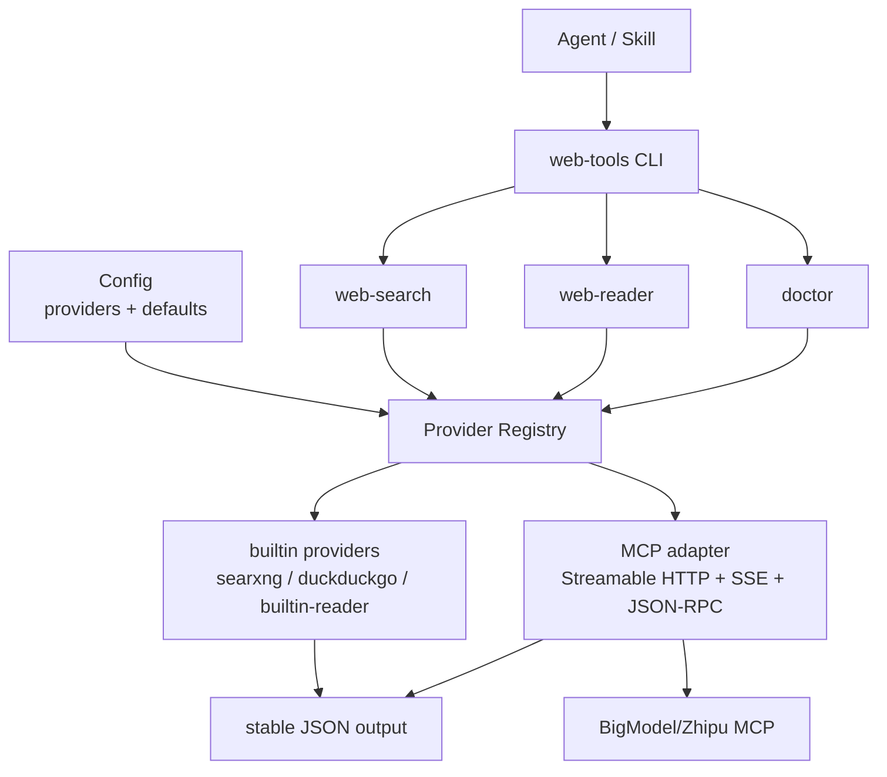

# web-tools

[English](README.md)


面向 AI Agent 的本地优先网页搜索和网页读取 CLI。

默认零成本，本地优先路径不需要 API key。

[Releases](https://github.com/koda-claw/web-tools/releases)

## 功能概览

- **web-search**：默认通过 DuckDuckGo Lite 搜索；可选本地 SearXNG；也支持已配置的 MCP provider。
- **web-reader**：从 URL 提取正文，或把本地文件（PDF、DOCX、PPTX、XLSX）转换为 Markdown；也支持已配置的 MCP reader provider。

## Agent 快速开始

如果另一个 Agent 只有这个仓库地址，按这个顺序执行：

1. 安装 `web-tools` CLI binary，或从源码构建。
2. 运行 `web-tools setup` 安装 Agent skill，并检查本地可用性。
3. 运行 `web-tools doctor --json`，只修复 hard error；缺少可选依赖通常只是 warning。
4. 用 `web-tools web-search "<query>" --json` 获取候选来源。
5. 用 `web-tools web-reader "<url>" --json` 读取选中的页面。
6. 检查 `quality` metadata；只有内容稀疏或页面依赖 JS 渲染时，才用 `--browser` 重试。

CLI 会输出明确的搜索、读取、质量和错误信号。Skill 负责指导 Agent 做来源选择、浏览器 fallback、部分失败处理和来源 URL 保留。


## 安装

### 下载 binary

从 [GitHub Releases](https://github.com/koda-claw/web-tools/releases) 下载：

```bash
# macOS ARM64
curl -sL https://github.com/koda-claw/web-tools/releases/latest/download/web-tools-darwin-arm64 -o /usr/local/bin/web-tools && chmod +x /usr/local/bin/web-tools

# macOS x64
curl -sL https://github.com/koda-claw/web-tools/releases/latest/download/web-tools-darwin-amd64 -o /usr/local/bin/web-tools && chmod +x /usr/local/bin/web-tools

# Linux x64
curl -sL https://github.com/koda-claw/web-tools/releases/latest/download/web-tools-linux-amd64 -o /usr/local/bin/web-tools && chmod +x /usr/local/bin/web-tools

# Windows x64
curl -sL https://github.com/koda-claw/web-tools/releases/latest/download/web-tools-windows-amd64.exe -o /usr/local/bin/web-tools.exe

# Windows ARM64
curl -sL https://github.com/koda-claw/web-tools/releases/latest/download/web-tools-windows-arm64.exe -o /usr/local/bin/web-tools.exe
```

### 从源码安装

需要 Go 1.23+。

```bash
git clone https://github.com/koda-claw/web-tools.git
cd web-tools

# 只安装 CLI
sh scripts/install.sh

# 安装 CLI，同时安装 Agent skill
SKILL_DIR="$HOME/.codex/skills" sh scripts/install.sh
```

确保安装目录在 `PATH` 中，然后验证：

```bash
web-tools --version
web-tools doctor --json
```

如果你只下载了 CLI binary，也可以直接用 CLI 初始化 Agent skill：

```bash
web-tools setup
```

## 快速使用

### 1. 搜索默认可用

`web-search` 默认使用 DuckDuckGo Lite，不需要 Docker 或 API key。

SearXNG 是可选后端，适合需要更高吞吐或更多来源时使用：

```bash
cd docker && docker compose up -d
```

验证：

```bash
curl -s http://localhost:8888/search?q=test&format=json | head -c 200
```

### 2. 安装可选 reader 依赖

```bash
# 文件转换：PDF、DOCX、PPTX、XLSX
pip install markitdown

# JS 渲染页面的浏览器 fallback
npm i -g agent-browser
```

### 3. 常用命令

```bash
# 搜索
web-tools web-search "latest AI news"
web-tools web-search "AI latest developments" --locale en-US --limit 3
web-tools web-search "golang readability" --include-domain github.com --exclude-domain reddit.com
web-tools web-search "golang readability" --provider duckduckgo --json

# 读取 URL
web-tools web-reader https://example.com/article
web-tools web-reader https://example.com/article --provider builtin-reader

# 转换文件
web-tools web-reader ./report.pdf

# 纯文本或 HTML 输出
web-tools web-reader https://example.com/article --format text
web-tools web-reader https://example.com/article --format html

# 检查本地环境
web-tools doctor
web-tools doctor --json

# 从 CLI 安装或更新 Agent skill
web-tools setup
```

## 测试

```bash
go vet ./...
go test ./...
./scripts/smoke.sh
```

`go test ./...` 包含离线 CLI 集成测试。测试会构建临时 `web-tools` binary，并用本地 HTTP fixture 验证 Agent 的 search-then-read 工作流，不依赖真实搜索引擎或真实浏览器。

## Doctor

用 `web-tools doctor` 检查本地配置和可选依赖。缺少 SearXNG、MarkItDown 或 agent-browser 等可选工具时会报告 warning；配置无效或缓存目录不可写会报告 error。

## 配置

配置文件可选，默认位置为 `~/.config/web-tools/config.json`，当前目录也可放 `./web-tools.json`。

```json
{
  "reader": {
    "cache_dir": "~/.cache/web-tools",
    "cache_ttl": 300,
    "default_timeout": 15,
    "browser_fallback": true,
    "markitdown_path": "markitdown",
    "agent_browser_path": "agent-browser",
    "default_provider": "auto",
    "default_provider_chain": ["builtin-reader"]
  },
  "search": {
    "searxng_url": "http://localhost:8888",
    "default_limit": 5,
    "default_locale": "auto",
    "default_engine": "auto",
    "default_provider": "auto",
    "default_provider_chain": ["searxng", "duckduckgo"]
  }
}
```

CLI 参数会覆盖配置默认值。`--format=html` 只在提取结果里真的有 HTML 时可用；纯文本和本地转换文件不会被包装成假的 HTML，而是返回结构化 input error。

`web-reader --json` 包含 `quality` 对象，包括提取评分、词数、最低词数阈值、是否建议 fallback 和原因。内容稀疏 warning 会写到 stderr，stdout 保持机器可读。

### Provider 配置

`--provider` 是新集成的推荐入口。`--engine` 继续保留，用于兼容 `auto`、`duckduckgo`、`searxng`。

默认无 key 路径仍然本地优先：

```text
search auto: searxng -> duckduckgo
reader auto: builtin-reader
```

BigModel/Zhipu MCP provider 可以通过 CLI 配置，不需要手写 JSON：

```bash
web-tools setup --provider bigmodel --auth-env ZHIPU_APIKEY
web-tools setup --provider bigmodel --auth-env ZHIPU_APIKEY --set-env ZHIPU_APIKEY=...
web-tools doctor --json
web-tools web-search "Go readability library" --provider bigmodel --json
web-tools web-reader "https://github.com/go-shiori/go-readability" --provider bigmodel --json
```

`--set-env` 会把 token 写到 `~/.config/web-tools/.env`，文件权限为 `0600`。
CLI 会自动加载这个用户级 env file；如果当前 shell 已经设置了同名环境变量，则 shell 值优先。
临时使用时，也可以只在当前 shell 中 `export ZHIPU_APIKEY=...`。

如果希望 `--provider auto` 的搜索 fallback 也尝试 BigModel：

```bash
web-tools setup \
  --provider bigmodel \
  --auth-env ZHIPU_APIKEY \
  --enable-search-auto
```

`web-tools setup` 会安装或更新 Agent skill，在需要时写 provider 配置，可选写入 env file，并运行 `doctor`。
如果只想改配置，也可以使用更聚焦的配置命令：

```bash
web-tools config provider add bigmodel --preset bigmodel --auth-env ZHIPU_APIKEY
```

这些命令默认写入 `~/.config/web-tools/config.json`，只保存环境变量名，不保存 token 值。
token 应放在当前 shell 环境变量或 `~/.config/web-tools/.env` 中，不会写入 `config.json`。等价 JSON：

```json
{
  "providers": {
    "bigmodel": {
      "type": "mcp",
      "auth_env": "ZHIPU_APIKEY",
      "enabled_if_env": "ZHIPU_APIKEY",
      "timeout": 30,
      "capabilities": ["search", "reader"],
      "search": {
        "url": "https://open.bigmodel.cn/api/mcp/web_search_prime/mcp",
        "tool": "web_search_prime"
      },
      "reader": {
        "url": "https://open.bigmodel.cn/api/mcp/web_reader/mcp",
        "tool": "webReader"
      }
    }
  },
  "search": {
    "default_provider_chain": ["searxng", "bigmodel", "duckduckgo"]
  }
}
```

Secret 只从环境变量读取。`doctor --json` 会报告认证是否已配置，但不会打印 token 值。


## 安装为 Agent Skill

兼容 [vercel-labs/skills](https://github.com/vercel-labs/skills) CLI：

```bash
npx skills add koda-claw/web-tools
```

也可以通过已安装的 `web-tools` CLI 安装：

```bash
web-tools skill install --dir "$HOME/.codex/skills"
```

源码 checkout 下也可以手动复制：

```bash
# Codex 本地 skill 目录
mkdir -p "$HOME/.codex/skills"
cp -R skills/web-tools "$HOME/.codex/skills/"

# 通用 Agent skill 目录
mkdir -p "$HOME/.agents/skills"
cp -R skills/web-tools "$HOME/.agents/skills/"
```

安装 skill 后，让 Agent 在网页搜索、网页读取、文章提取或文件转 Markdown 时使用 `web-tools`。Skill 内包含 Agent research workflow。

## Provider 开发

新增搜索或读取后端时，先看 [`docs/provider-plugin-development-guide.md`](docs/provider-plugin-development-guide.md)。

当前 provider 模型是配置优先：能通过 `providers.<id>` 和已有 adapter 接入时，不要新增代码；只有协议或响应映射无法复用时，才新增 adapter。

## 架构



```text
web-tools
├── cmd/web-reader/     # web-reader CLI 入口
├── cmd/web-search/     # web-search CLI 入口
├── internal/
│   ├── config/         # 配置加载：文件 + env + defaults
│   ├── errors/         # 面向 Agent 的结构化错误
│   ├── provider/       # Provider registry 和 MCP adapter
│   ├── reader/         # HTTP fetch、readability、cache、converter、browser fallback
│   └── search/         # SearXNG client、结果解析、输出格式
├── docker/             # SearXNG docker-compose.yml + settings
└── skills/             # Agent skill 文档
```

## License

MIT
