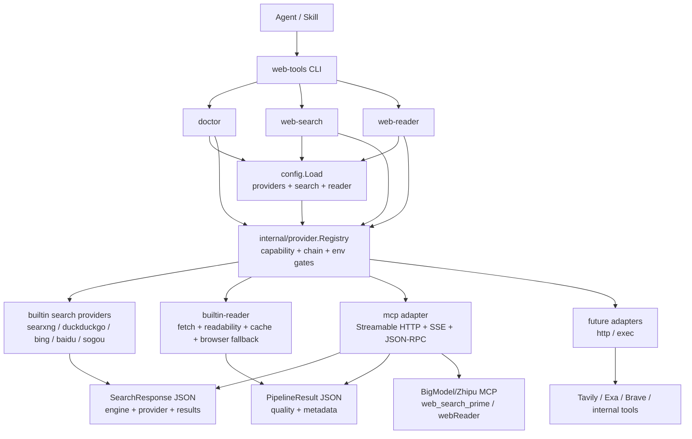
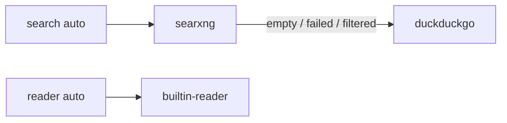
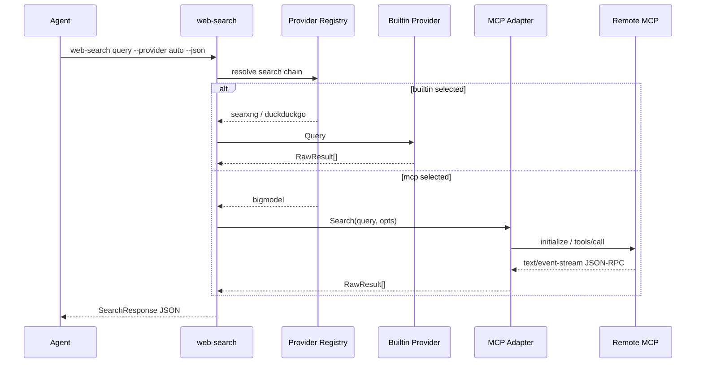
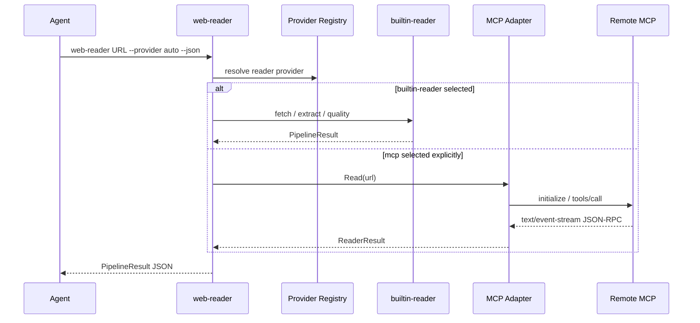
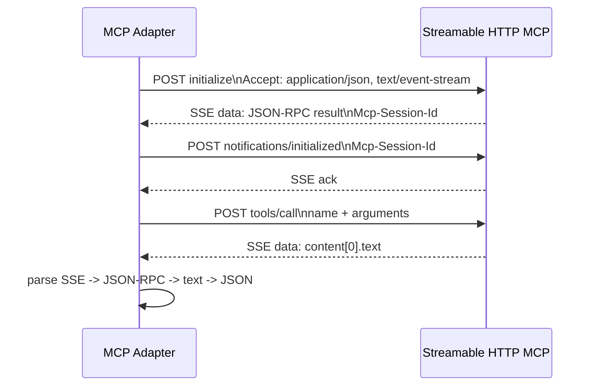

# Provider / Plugin 架构设计

## 背景

web-tools 当前已经具备稳定的本地搜索与读取原语：

- `web-search`：内置 `searxng`、`duckduckgo`，支持 `auto` fallback。
- `web-reader`：内置 HTTP fetch、readability、MarkItDown、cache、agent-browser fallback。

下一阶段会接入更多外部能力，例如 Tavily、Exa、Brave、BigModel Search MCP、BigModel Reader MCP 或企业内部搜索。如果继续把每个服务直接硬编码到 CLI，会造成：

- 配置字段持续膨胀。
- `web-search` 与 `web-reader` 的 provider 选择逻辑重复。
- 外部服务的鉴权、健康检查、capability、错误映射难以统一。
- Agent skill 很难描述“什么时候选择哪个后端”。

因此，后续应从“引擎”升级为统一的 Provider / Plugin 架构。

## 目标

- 让 search 和 reader 都支持 provider 化，而不是只给搜索加插件。
- 保持现有 CLI 行为兼容，默认无 key 仍可本地优先运行。
- 允许通过配置启用新的 provider；只有出现新协议或新响应格式时才新增 adapter 代码。
- 支持多种 provider 类型：`builtin`、`http`、`mcp`、`exec`。
- 支持 `doctor --json` 诊断 provider 状态，但不泄漏 API key。
- 保持 stdout 机器可读，warnings 和 diagnostics 仍走 stderr。
- 为 BigModel Search MCP / Reader MCP 预留一等接入路径。

## 设计结论

Provider / Plugin 不是 Go 动态插件，而是“配置声明 + 稳定 adapter”的扩展模型：

1. 内置能力通过 `builtin` provider 注册，例如 `searxng`、`duckduckgo`、`builtin-reader`。
2. 标准远程能力通过通用 adapter 接入，例如 `http`、`mcp`、`exec`。
3. 具体服务通过 `providers.<id>` 配置声明 URL、tool、auth、capability 和映射策略。
4. CLI 只关心 provider id、capability 和 chain，不直接写死某个外部服务。
5. Agent skill 只需要指导“如何选择 provider、如何检查 doctor、如何读取 quality 和 fallback 信息”。

这样后续新增引擎时优先走配置：

```text
新增支持同协议服务 -> 新增 providers.<id> 配置
新增响应结构但协议相同 -> 新增 mapping 配置或小 adapter
新增协议类型 -> 新增 provider type adapter
```

## 架构图



默认无 key 路径仍是内置 provider：



## 非目标

- 不使用 Go 动态 `plugin` 包。它跨平台发布复杂，不适合当前单二进制模型。
- 不在第一阶段实现所有外部服务。
- 不把总结、引用生成、可信度判断固化到 CLI。
- 不让 provider 隐藏底层错误；Agent 仍需要看到结构化失败信息。
- 不要求用户必须配置付费 provider；无 key 场景仍应可用。

## 核心概念

### Provider

Provider 是一个可诊断、可声明 capability、可执行 search 或 reader 能力的后端。

```text
Provider
  ├─ id: stable provider id, for example searxng / duckduckgo / bigmodel
  ├─ type: builtin / http / mcp / exec
  ├─ capabilities: search, reader, news, images, browser_required, auth_required
  ├─ health: provider-level diagnostics
  └─ adapters: SearchProvider and/or ReaderProvider
```

### SearchProvider

```go
type SearchProvider interface {
    ID() string
    Capabilities() ProviderCapabilities
    HealthCheck(ctx context.Context) ProviderHealth
    Search(ctx context.Context, query string, opts SearchOptions) (*SearchResponse, error)
}
```

### ReaderProvider

```go
type ReaderProvider interface {
    ID() string
    Capabilities() ProviderCapabilities
    HealthCheck(ctx context.Context) ProviderHealth
    Read(ctx context.Context, input string, opts ReaderOptions) (*ReaderResponse, error)
}
```

现有 `SearchResponse` 和 `PipelineResult` 可以作为外部 JSON 合约继续保留。内部可以先做 adapter 包装，避免一次性重写所有结构。

## Provider 类型

### builtin

内置实现，不需要外部进程或远程服务。

当前 builtin provider：

- `duckduckgo`：search only。
- `searxng`：search only，需要本地 SearXNG。
- `bing`：search only，显式 provider，不在默认 auto chain。
- `baidu`：search only，显式 provider，不在默认 auto chain。
- `sogou`：search only，显式 provider，不在默认 auto chain；部分网络容易触发验证码。
- `builtin-reader`：reader only，包含 HTTP fetch、readability、MarkItDown、cache、agent-browser fallback。

### http

直接调用 HTTP API 的 provider，例如 Tavily、Exa、Brave。适合 API 形态稳定、无需 MCP 客户端协议的服务。

要求：

- 第一阶段 API key 只通过 `auth_env` 引用。
- 请求/响应映射有独立 adapter。
- 错误映射成统一 structured error。
- 单元测试用 `httptest`，不打真实 API。

### mcp

调用远程或本地 MCP server 的 provider，例如 BigModel Search MCP / Reader MCP。

要求：

- 支持 endpoint URL。
- 支持 tool name。
- 优先支持 Streamable HTTP endpoint；实测 BigModel 会在该 endpoint 返回 `text/event-stream`，因此第一阶段必须解析 SSE event。独立 `/sse` endpoint 可作为后续兼容项。
- 支持 `Authorization: Bearer <token>`，token 来自 `auth_env`。
- 支持 health/capability 探测，或在不支持探测时做 lightweight tool metadata check。
- MCP adapter 负责把 MCP tool result 映射为 web-tools 的稳定 JSON 输出。

### exec

调用本地可执行文件的 provider。适合企业内部搜索、用户自定义脚本、实验性 provider。

要求：

- stdin/stdout 使用 JSON。
- 超时、退出码、stderr 统一映射。
- 默认不启用，必须显式配置。
- `doctor` 检查 binary 是否存在。

## 建议配置

为了避免继续扩张 `search.*` 和 `reader.*` 的平铺字段，建议新增顶层 `providers`。

```json
{
  "providers": {
    "bigmodel": {
      "type": "mcp",
      "auth_env": "ZHIPU_APIKEY",
      "enabled_if_env": "ZHIPU_APIKEY",
      "timeout": 30,
      "search": {
        "url": "https://open.bigmodel.cn/api/mcp/web_search_prime/mcp",
        "tool": "web_search_prime"
      },
      "reader": {
        "url": "https://open.bigmodel.cn/api/mcp/web_reader/mcp",
        "tool": "webReader"
      }
    },
    "internal-search": {
      "type": "exec",
      "command": "/usr/local/bin/internal-search-provider",
      "timeout": 15,
      "capabilities": ["search"]
    }
  },
  "search": {
    "default_provider": "auto",
    "default_provider_chain": ["searxng", "duckduckgo"]
  },
  "reader": {
    "default_provider": "auto",
    "default_provider_chain": ["builtin-reader"]
  }
}
```

如果用户明确配置了带认证 provider，可以把它加入链路：

```json
{
  "search": {
    "default_provider_chain": ["searxng", "bigmodel", "duckduckgo"]
  },
  "reader": {
    "default_provider_chain": ["builtin-reader", "bigmodel"]
  }
}
```

兼容策略：

- `search.default_engine` 保留一段时间，映射到 `search.default_provider`。
- `--engine` 保留，作为 `--provider` 的兼容别名。
- 新增 `--provider`，文档优先使用 `--provider`。
- 旧配置不需要迁移即可继续工作。
- 当 `default_provider` 缺省时，如果旧 `default_engine` 存在，则使用旧字段。
- 当 `default_provider_chain` 缺省时，使用内置默认链，避免用户必须理解 provider 才能继续使用。
- 如果 `--provider` 和 `--engine` 同时显式传入且值不一致，返回 structured input error，不做隐式优先级猜测。
- 如果 `--provider` 和 `--engine` 同时显式传入且值一致，允许执行，并在 stderr 输出一次兼容提示。

配置优先级保持当前模型：

```text
WEB_TOOLS_CONFIG 指定文件 > env vars > ./web-tools.json > ~/.config/web-tools/config.json > defaults
```

需要注意：provider 的 secret 不直接写入配置，配置只保存 `auth_env`。`doctor` 可以报告 `auth_configured=true/false`，不能输出 env 值。

认证行为：

- `auto` chain 遇到 `enabled_if_env` 未满足的 provider 时跳过，并在 attempts metadata 中标记 `skipped:not_configured`。
- 显式选择 `--provider <id>` 时，如果该 provider 需要 `auth_env` 但 env 不存在，返回 structured config/auth error。
- `doctor --json` 对缺少 env 的可选 provider 输出 `warn`，不让默认无 key 链路失败。

## CLI 设计

### web-search



```bash
web-tools web-search "query" --provider auto --json
web-tools web-search "query" --provider bigmodel --json
web-tools web-search "query" --provider duckduckgo --json
```

兼容：

```bash
web-tools web-search "query" --engine duckduckgo --json
```

### web-reader



```bash
web-tools web-reader "https://example.com" --provider auto --json
web-tools web-reader "https://example.com" --provider bigmodel --json
web-tools web-reader "https://example.com" --provider builtin-reader --json
```

reader auto 默认策略：

```text
builtin-reader
```

如果用户在 `reader.default_provider_chain` 中显式加入远程 provider，则可以启用低质量 fallback：

```text
builtin-reader -> bigmodel(if configured and builtin quality low)
```

注意：reader provider fallback 必须保留质量信号。如果 builtin 读取质量低并切到 BigModel，JSON 输出应保留类似 `attempts` 或 `metadata.provider_chain` 的可追踪信息。第一阶段可以先不改变 JSON 合约，只把 provider 信息放进 `metadata`。默认无 key 配置不调用远程 reader provider。

Search provider chain 初始策略建议：

```text
searxng -> duckduckgo
```

如果配置了带认证的远程 provider，可以显式加入链路：

```text
searxng -> bigmodel(if configured) -> duckduckgo
```

不建议默认把付费或额度型 provider 插入所有用户的默认链路。它们应通过配置显式启用。

## BigModel MCP 示例

BigModel 当前提供两类 MCP：

- Search MCP
  - endpoint: `https://open.bigmodel.cn/api/mcp/web_search_prime/mcp`
  - tool: `web_search_prime`
- Reader MCP
  - endpoint: `https://open.bigmodel.cn/api/mcp/web_reader/mcp`
  - tool: `webReader`

这些 MCP 属于 GLM Coding Plan 的远程 MCP 能力，需要 API key 或对应计划额度。它适合作为 `mcp` provider 样例和可选增强，不应成为无 key 默认路径。

2026-06-14 live probe 结果：

- Search MCP 和 Reader MCP 的 `initialize`、`tools/list`、`tools/call` 均可用。
- 两个 endpoint 都返回 `content-type: text/event-stream`，并通过 `mcp-session-id` 维持会话。
- 请求 `Accept` 需要包含 `text/event-stream`；只传 `Accept: application/json` 会返回 HTTP 400。
- Search MCP 的实际 tool name 是 `web_search_prime`；`webSearchPrime` 会返回 `Tool not found`。
- Search MCP 的 tool result 是 `content[0].text` 内的 JSON 字符串，字段形态为 `title`、`link`、`content`、`refer`。
- Reader MCP 的 tool result 也是 `content[0].text` 内的 JSON 字符串，字段形态为 `title`、`description`、`url`、`content`、`metadata`、`external` 等。
- MCP adapter 需要按顺序解析：SSE event -> JSON-RPC envelope -> MCP content text -> JSON 字符串。

接入方式建议：

```json
{
  "providers": {
    "bigmodel": {
      "type": "mcp",
      "auth_env": "ZHIPU_APIKEY",
      "enabled_if_env": "ZHIPU_APIKEY",
      "search": {
        "url": "https://open.bigmodel.cn/api/mcp/web_search_prime/mcp",
        "tool": "web_search_prime"
      },
      "reader": {
        "url": "https://open.bigmodel.cn/api/mcp/web_reader/mcp",
        "tool": "webReader"
      }
    }
  }
}
```

实现时优先支持如下抽象字段，不把 BigModel 写死在核心流程里：

| 字段 | 含义 |
|------|------|
| `type` | provider adapter 类型，BigModel 使用 `mcp` |
| `auth_env` | 从哪个环境变量读取 token |
| `enabled_if_env` | 只有 env 存在时才加入 auto chain |
| `search.url` | Search MCP endpoint |
| `search.tool` | Search MCP tool name |
| `reader.url` | Reader MCP endpoint |
| `reader.tool` | Reader MCP tool name |

`doctor --json` 输出不应包含 key，只显示：

```json
{
  "name": "provider.bigmodel",
  "status": "ok",
  "message": "provider configured",
  "details": {
    "type": "mcp",
    "auth_env": "ZHIPU_APIKEY",
    "auth_configured": "true",
    "capabilities": "search,reader"
  }
}
```

## 错误与安全

- 不打印 API key、Authorization header、cookie、完整 token。
- provider timeout 必须可配置，默认沿用现有 CLI timeout。
- provider 返回的页面内容视为不可信输入，由 Agent skill 继续要求保留来源和证据链。
- exec provider 默认关闭，必须显式配置 command。
- remote provider 的错误需要映射到现有 structured error 分类：`input`、`network`、`engine`、`extract`、`unreachable`。
- provider chain 必须保留 attempts metadata，至少能看出尝试过哪些 provider、哪个 provider 返回了结果、哪些 provider 因未配置或错误被跳过。

建议错误映射：

| 场景 | 分类 | 行为 |
|------|------|------|
| `--provider` 和 `--engine` 冲突 | `input` | 直接失败，提示只保留一个参数或传相同值 |
| 显式 provider 缺少 `auth_env` | `input` 或 `unreachable` | 配置错误，不能 fallback 到其他 provider |
| auto chain provider 缺少 `enabled_if_env` | 不作为错误 | 跳过该 provider，记录 attempt |
| remote provider 超时或网络失败 | `network` | auto chain 可继续尝试下一个 provider |
| provider 返回结构无法映射 | `engine` 或 `extract` | search 用 `engine`，reader 用 `extract` |

## 输出兼容

Phase 3 不能破坏当前 Agent 已经依赖的 JSON 合约。

Search 输出：

- 保留 `ok`、`result.query`、`result.engine`、`result.results`。
- 新增 provider 信息时，优先使用向后兼容字段，例如 `result.provider` 和 `result.provider_chain`。
- `result.engine` 在迁移期继续填写最终 provider 对应的旧 engine 名；远程 provider 可填 provider id。

Reader 输出：

- 保留当前 `PipelineResult` JSON 结构。
- `quality` 继续表达读取质量。
- provider 信息优先放入 `metadata.provider`、`metadata.provider_chain` 或新增 `attempts`。
- Markdown/text/html 输出不应出现调试噪音；diagnostics 仍走 stderr 或 JSON metadata。

## 测试策略

必须保持离线可测。

### 单元测试

- Provider registry 解析配置。
- Provider config overlay 合并。
- `--provider` 与旧 `--engine` 的兼容优先级。
- Provider chain 选择顺序。
- Provider health 输出不泄漏 secret。
- MCP request/response 映射。
- exec provider 超时、非零退出码、stderr 映射。

### 集成测试

- 本地 mock HTTP provider。
- 本地 mock MCP server。
- 本地 mock exec provider。
- search auto 从 provider A 空结果 fallback 到 provider B。
- reader auto 从 builtin low-quality fallback 到 mock provider。
- JSON 输出保持向后兼容。

### 真实测试

真实 provider 测试不进入默认 CI。通过显式环境变量开启：

```bash
WEB_TOOLS_LIVE_PROVIDER_TEST=bigmodel ZHIPU_APIKEY=... go test ./...
```

真实测试只验证 adapter 与服务连通，不作为发布阻断的默认条件。发布阻断应依赖离线 mock 测试，避免外部额度、网络和账号状态影响基础发布。

## MCP 最小协议契约



MCP provider adapter 第一阶段只支持 Streamable HTTP。实现前必须先冻结 mock MCP server fixture，避免把 BigModel 的私有行为写进通用 adapter。

最小请求链路：

1. 使用 JSON-RPC 2.0 envelope。
2. 支持 `initialize`，获取协议能力或完成基础握手。
3. 支持 `tools/list` 或配置静态 tool name。若服务不支持 tool list，允许跳过探测但必须在 doctor 中说明。
4. 使用 `tools/call` 调用配置中的 `search.tool` 或 `reader.tool`。
5. 支持 `text/event-stream` response，并从 `data:` event 中解析 JSON-RPC payload。
6. 请求 `Accept` 至少包含 `application/json, text/event-stream`。

mock fixture 必须覆盖：

- 正常 tool result，包含 search results。
- 正常 tool result，包含 reader title/content/metadata。
- SSE event 包装的 JSON-RPC response。
- `content[0].text` 为 JSON 字符串的 tool result。
- JSON-RPC error response。
- HTTP 非 2xx。
- 超时。
- malformed tool result。
- Authorization header 存在但不会出现在日志、错误或测试快照中。

映射策略：

- Search MCP 结果必须映射为现有 `SearchResponse` 兼容结构。
- Reader MCP 结果必须映射为现有 `PipelineResult` 兼容结构。
- 如果 tool result 是文本块，adapter 先尝试 JSON unquote，再 JSON parse；失败时 reader 可以当正文文本处理，search 必须返回映射错误。
- 所有 MCP adapter 单元测试使用本地 mock server，不访问真实 BigModel。

## 分层落地策略

### 第一层：配置与诊断

先让配置能表达 provider，但不改变现有命令行为。

- `internal/config` 增加 provider 结构。
- `doctor --json` 输出 provider 摘要。
- 所有 secret 仅显示是否配置。

### 第二层：Registry

建立 capability 和 chain 解析，不急着切 CLI 主流程。

- 内置 provider 注册。
- 未知 provider 和 capability mismatch 结构化报错。
- 默认 chain 与配置 chain 可测试。

### 第三层：Search 接入

先把当前 search engine 包装为 search provider。

- `--provider` 新增。
- `--engine` 继续可用。
- `auto` 从 engine list 迁移到 provider chain。

### 第四层：Reader 接入

把当前 reader pipeline 包装为 `builtin-reader`。

- `--provider builtin-reader` 行为等同当前默认读取。
- low-quality fallback 先只在 mock provider 中验证。
- BigModel reader fallback 等 MCP adapter 稳定后再启用。

### 第五层：MCP Adapter 与 BigModel

先 mock，再接真实服务。

- 实现通用 MCP HTTP adapter。
- 用 mock MCP server 覆盖 search/read tool 调用。
- BigModel 只是配置样例和 live test 目标，不应侵入核心流程。

## 迁移计划

### Phase 3A：设计与配置骨架

**文件：** `docs/provider-architecture.md`、`internal/config/*`

- 增加 provider 配置结构。
- 保持旧配置兼容。
- `doctor --json` 能列出 provider 配置状态。

**验收**

- 旧配置测试全部通过。
- 新 provider 配置能被加载但不影响运行。
- secret 不出现在 doctor 输出中。
- `docs/provider-architecture.md` 明确 BigModel 是可选 MCP provider，不是默认免费后端。

### Phase 3B：Provider Registry

**文件：** `internal/provider/*`

- 定义 `Provider`、`SearchProvider`、`ReaderProvider`、`Registry`。
- 把 builtin provider 注册进去。
- 先不改 CLI 输出。

**验收**

- `searxng`、`duckduckgo`、`builtin-reader` 都能通过 registry 获取。
- registry 单测覆盖未知 provider、capability mismatch、chain fallback。

### Phase 3C：Search CLI 接入 provider

**文件：** `cmd/web-search/*`、`internal/search/*`、`internal/provider/*`

- 新增 `--provider`。
- 保留 `--engine`。
- `auto` 使用 provider chain。

**验收**

- 现有 `--engine` 测试不破。
- 新 `--provider` 测试通过。
- search 离线集成测试覆盖 provider chain。

### Phase 3D：Reader CLI 接入 provider

**文件：** `cmd/web-reader/*`、`internal/reader/*`、`internal/provider/*`

- 新增 `--provider`。
- builtin reader 作为默认 provider。
- 为后续 BigModel Reader MCP fallback 预留 provider metadata。

**验收**

- 现有 reader 输出不破。
- reader 低质量结果可以触发 mock provider fallback。
- JSON 输出保持兼容。

### Phase 3E：MCP Provider Adapter

**文件：** `internal/provider/mcp/*`

- 实现 MCP HTTP client。
- 支持 tool 调用。
- 支持 search 和 reader 映射。
- 先用 mock MCP server 测试。
- 冻结 MCP mock request/response fixture，覆盖 JSON-RPC success、JSON-RPC error、HTTP error、timeout 和 malformed result。

**验收**

- mock BigModel Search MCP 返回 search results。
- mock BigModel Reader MCP 返回 title/content/metadata。
- 错误与超时映射稳定。
- adapter 不依赖 BigModel 专用字段即可通过 mock tests。

### Phase 3F：BigModel Provider

**文件：** `internal/provider/bigmodel/*`、README、skill docs

- 配置 `bigmodel` provider。
- 支持 Search MCP 和 Reader MCP。
- `doctor` 显示配置状态。
- skill 文档说明如何配置 `ZHIPU_APIKEY` 或用户自定义的 `auth_env`。
- 文档说明 BigModel 需要账号/API key/额度，不影响无 key 默认链路。

**验收**

- 无 key 时默认链路不受影响。
- 有 key 时 `--provider bigmodel` 可用。
- live test 通过，但不进入默认 CI。

## 当前实现状态

Phase 3 已落地：

- `internal/config` 支持顶层 `providers`、search/reader `default_provider` 和 `default_provider_chain`。
- `web-tools doctor --json` 输出 provider 摘要和 auth configured 状态，不输出 token 值。
- `internal/provider` 提供 registry、capability 检查、chain 解析、`enabled_if_env` 跳过和 attempt metadata。
- `web-search --provider` 已支持 builtin providers 和 MCP search provider。
- `web-reader --provider` 已支持 `builtin-reader` 和 MCP reader provider URL 输入。
- `internal/provider/mcp` 已支持 Streamable HTTP response、SSE `data:` 解析、JSON-RPC envelope、`tools/call` 和 `content[0].text` JSON 字符串解析。
- BigModel/Zhipu MCP 已通过 `ZHIPU_APIKEY` live smoke 验证。

## 推荐下一步

后续新增 provider 时优先通过配置接入。如果目标服务不是 MCP 或返回结构无法通过当前 adapter 映射，再新增对应 provider type 或 mapping adapter。

## 当前未确认项与建议

| 未确认项 | 建议 |
|----------|------|
| 是否支持 SSE MCP endpoint | 实测 BigModel Streamable HTTP 返回 `text/event-stream`，第一阶段必须支持 SSE event 解析；独立 `/sse` endpoint 仍留到后续。 |
| 是否把 BigModel 放入默认 auto chain | 不默认加入；只有用户配置 `enabled_if_env` 且 env 存在时才加入。 |
| 是否允许配置内直接写 API key | 不允许；只允许 `auth_env`，避免配置文件泄漏。 |
| 是否马上实现 `http` provider 通用映射 DSL | 暂缓；先做 `mcp` 和 `exec` 的最小 adapter，HTTP provider 等明确目标服务后再定映射。 |
| Reader fallback 是否默认调用远程 provider | 不默认；先通过 mock 验证，再由配置显式开启。 |
| `--provider` 与 `--engine` 冲突时如何处理 | 返回 structured input error，不做隐式优先级猜测。 |
