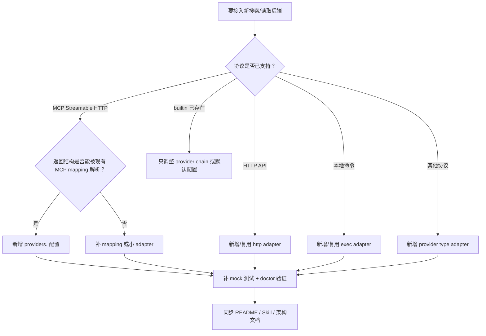

# Provider 插件开发指南

本文面向后续为 `web-tools` 接入新搜索或网页读取后端的开发者和 Agent。目标是让新增 provider 时有稳定路径：优先通过配置接入，只有协议或响应结构无法复用时才新增少量 adapter 代码。

## 适用范围

当前 provider/plugin 架构不是 Go 动态插件，而是：

```text
provider 配置声明 + 稳定 adapter + CLI provider chain
```

适合接入：

- MCP Streamable HTTP 服务，例如 BigModel/Zhipu Search MCP、Reader MCP。
- 未来 HTTP API 服务，例如 Tavily、Exa、Brave Search、企业内部搜索。
- 未来本地命令服务，例如已有的公司内部 CLI 或脚本。
- 内置能力，例如 `searxng`、`duckduckgo`、`builtin-reader`。

不适合：

- 需要在运行时加载第三方 Go `.so` 的动态插件。
- 把总结、引用生成、可信度判断塞进 provider；这些属于 Agent workflow 或上层编排。
- 把 secret 写进配置文件。

## 接入决策树

新增 provider 前先按顺序判断：



优先级建议：

1. 同协议、同结构：只新增配置和文档。
2. 同协议、不同结构：新增 mapping 或局部解析逻辑。
3. 新协议：新增 adapter，并补完整 mock fixture。
4. 新默认策略：必须说明 fallback 顺序和失败语义。

## Provider 配置字段

Provider 配置位于顶层 `providers`：

```json
{
  "providers": {
    "provider-id": {
      "type": "mcp",
      "auth_env": "PROVIDER_API_KEY",
      "enabled_if_env": "PROVIDER_API_KEY",
      "timeout": 30,
      "capabilities": ["search", "reader"],
      "search": {
        "url": "https://example.com/mcp/search",
        "tool": "searchTool"
      },
      "reader": {
        "url": "https://example.com/mcp/reader",
        "tool": "readerTool"
      },
      "headers": {
        "X-Provider-Version": "2026-06"
      },
      "metadata": {
        "homepage": "https://example.com"
      }
    }
  }
}
```

字段约定：

| 字段 | 必填 | 说明 |
| --- | --- | --- |
| `type` | 是 | `builtin`、`mcp`，未来可扩展为 `http`、`exec`。 |
| `capabilities` | 是 | 至少包含 `search` 或 `reader`。 |
| `auth_env` | 否 | 存放 token 的环境变量名。配置只能写 env 名，不能写 secret 值。 |
| `enabled_if_env` | 否 | env 不存在时，`auto` chain 跳过该 provider。 |
| `timeout` | 否 | provider 调用超时，单位秒。 |
| `search.url` | search provider 必填 | 搜索端点。 |
| `search.tool` | MCP search 必填 | MCP tool name。 |
| `reader.url` | reader provider 必填 | 读取端点。 |
| `reader.tool` | MCP reader 必填 | MCP tool name。 |
| `headers` | 否 | 非敏感固定 header。不要放 token。 |
| `metadata` | 否 | 文档、主页、版本等诊断信息。 |

`doctor --json` 可以输出 provider 是否启用、是否配置认证、能力列表和配置问题，但不能输出 secret 值。

## Provider chain 策略

搜索默认链路：

```json
{
  "search": {
    "default_provider": "auto",
    "default_provider_chain": ["searxng", "duckduckgo"]
  }
}
```

读取默认链路：

```json
{
  "reader": {
    "default_provider": "auto",
    "default_provider_chain": ["builtin-reader"]
  }
}
```

设计原则：

- 默认无 key 路径必须可用。
- 付费或外部 provider 不应默认阻断本地链路。
- `auto` 遇到 `enabled_if_env` 不满足的 provider，应跳过并记录 attempts metadata。
- 显式 `--provider <id>` 缺少认证时，应失败并返回结构化错误。
- `web-reader` 默认不自动把低质量页面交给远程 provider，除非用户显式配置 reader chain 或显式传 `--provider`。

## MCP Provider 接入

MCP Streamable HTTP provider 需要满足最小协议契约：

1. JSON-RPC 2.0 envelope。
2. `initialize`。
3. `notifications/initialized`。
4. `tools/call`。
5. 响应 `application/json` 或 `text/event-stream`。
6. SSE 场景下从 `data:` event 中解析 JSON-RPC payload。

当前已验证的 BigModel/Zhipu 配置：

```json
{
  "providers": {
    "bigmodel": {
      "type": "mcp",
      "auth_env": "ZHIPU_APIKEY",
      "enabled_if_env": "ZHIPU_APIKEY",
      "timeout": 30,
      "capabilities": ["search", "reader"],
      "search": {
        "url": "https://open.bigmodel.cn/api/mcp/web_search_prime/mcp",
        "tool": "web_search_prime"
      },
      "reader": {
        "url": "https://open.bigmodel.cn/api/mcp/web_reader/mcp",
        "tool": "webReader"
      }
    }
  }
}
```

验证命令：

```bash
export ZHIPU_APIKEY=...
web-tools doctor --json
web-tools web-search "Go readability library" --provider bigmodel --json
web-tools web-reader "https://github.com/go-shiori/go-readability" --provider bigmodel --json
```

不要把 live provider 测试放进默认 CI。默认 CI 应依赖 mock MCP server，真实服务只作为显式验收。

## 新增 Adapter 的代码位置

通用 provider 抽象：

```text
internal/provider/provider.go
```

MCP adapter：

```text
internal/provider/mcp/
```

配置结构：

```text
internal/config/config.go
internal/config/loader.go
```

CLI 入口：

```text
cmd/web-search/main.go
cmd/web-reader/main.go
cmd/doctor/main.go
```

新增 adapter 时，建议保持以下边界：

- adapter 只负责协议、认证、请求、响应解析和错误映射。
- provider registry 负责 capability、chain、env gate 和 attempts metadata。
- `cmd/web-search`、`cmd/web-reader` 只负责 CLI 参数、配置加载和输出。
- `internal/search`、`internal/reader` 保持稳定输出结构，避免每个 provider 暴露一套 JSON。

## 测试要求

每个新 provider 或 adapter 至少覆盖：

### 单元测试

- 配置加载：`providers.<id>`、capabilities、timeout、endpoint。
- secret 安全：`auth_env` 只输出 env 名或布尔状态，不输出 token 值。
- env gate：`enabled_if_env` 缺失时 `auto` 跳过。
- 显式 provider：缺失认证时返回结构化错误。
- capability 不匹配：search provider 不能用于 reader，反之亦然。
- provider chain：空结果、失败、跳过时的 fallback 行为。

### Adapter 测试

- 正常 search 响应映射。
- 正常 reader 响应映射。
- SSE `data:` 事件解析。
- `content[0].text` 为 JSON 字符串的二次解析。
- JSON-RPC error。
- HTTP 非 2xx。
- 超时。
- 错误信息不泄漏 secret。

### CLI 集成测试

- `web-search --provider <id> --json` 输出包含 `provider` 和 `provider_chain`。
- `web-reader --provider <id> --json` 输出保持稳定结构。
- `--provider` 与 `--engine` 冲突时返回 structured input error。
- `doctor --json` 输出 provider diagnostics。

### 真实验收

真实验收通过显式环境变量开启，不作为默认 CI 阻断：

```bash
WEB_TOOLS_LIVE_PROVIDER_TEST=provider-id PROVIDER_API_KEY=... go test ./...
```

也可以用 CLI smoke：

```bash
web-tools doctor --json
web-tools web-search "provider smoke query" --provider provider-id --json
web-tools web-reader "https://example.com" --provider provider-id --json
```

## 文档同步清单

新增 provider 或 adapter 后，同步以下文档：

- `README.md`：安装、配置、快速使用示例。
- `skills/web-tools/SKILL.md`：Agent 如何选择 provider、如何处理失败和 fallback。
- `docs/provider-architecture.md`：架构、协议、限制、实现状态。
- `docs/research-workflow-design.md`：research workflow 中的 provider 策略。
- `docs/iteration-plan.md`：任务状态、验收结果和未决问题。
- `CHANGELOG.md`：版本发布说明。

Skill 文档保持英文；方案、计划和架构文档保持中文。

## 发布前检查

发布前必须通过：

```bash
go test ./...
go vet ./...
./scripts/smoke.sh
git diff --check
```

如果改动涉及 live provider，还应记录一次真实 smoke 的命令、provider、时间和结果，但不能提交 `.env` 或 token。

## 常见问题

### provider 和 engine 是什么关系？

`--provider` 是新扩展入口。`--engine` 只保留给旧的搜索引擎兼容路径，支持 `auto`、`duckduckgo`、`searxng`。

### 新 provider 应该默认加入 auto chain 吗？

默认不要。只有无 key、低风险、稳定的 provider 才适合默认加入。需要 key、可能计费或有不稳定额度的 provider，应通过用户配置加入 chain。

### reader 是否应该自动 fallback 到远程 MCP？

默认不要。读取网页可能涉及成本、隐私和内容发送到外部服务。远程 reader 应由显式 `--provider` 或用户配置的 `reader.default_provider_chain` 开启。

### doctor 缺少可选 provider 的 env 应该失败吗？

不应该。可选 provider 缺少 env 是 warn。只有默认链路硬依赖该 provider，或用户显式选择该 provider 时，才应该失败。

### 可以把 API key 写在 `headers.Authorization` 吗？

不可以。配置文件只能存非敏感 header。token 必须来自 `auth_env` 指定的环境变量。
